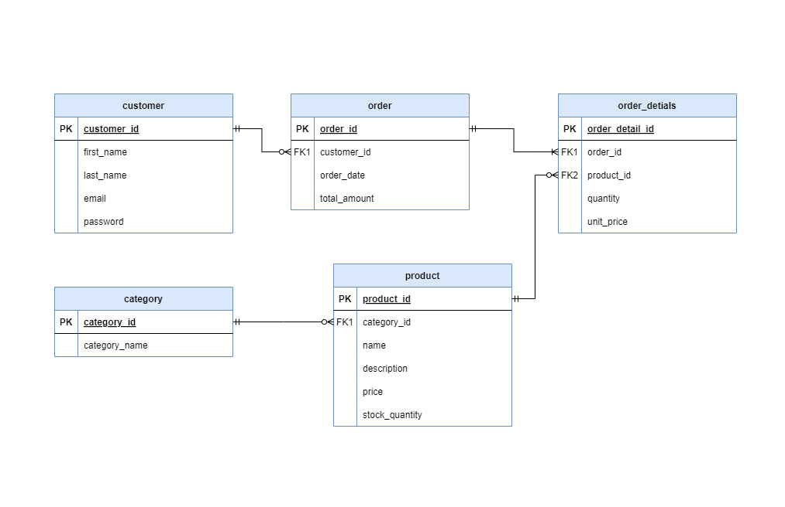

# E-commerce Database

## Table of Contents

- [Overview](#overview)
- [Data Model](#data-model)
- [Database Schema and Setup](#database-schema-and-setup)
  - [Category Table](#category-table)
  - [Product Table](#product-table)
  - [Customer Table](#customer-table)
  - [Order Table](#order-table)
  - [Order Details Table](#order-details-table)
- [Insert Sample Data](#insert-sample-data)
- [Commonly Used Queries](#insert-sample-data)
- [Notes](#notes)

---

## Overview

This project demonstrates a simple e-commerce database that manages categories, products, customers, orders, and order details. It provides a functional schema for core e-commerce operations.

---

## Data Model

The database schema is designed to reflect relationships between key entities in an e-commerce system. Below is the Entity-Relationship Diagram (ERD):



---

## Database Schema and Setup

This section explains each table in the database and how to create it. Follow the provided SQL queries to set up the schema.

---

### Category Table

Stores product categories, such as "Electronics" or "Books".  
**Columns**:

- `category_id`: Unique identifier (Primary Key).
- `category_name`: Name of the category.

```sql
CREATE TABLE category (
    category_id SERIAL PRIMARY KEY,
    category_name VARCHAR(100) NOT NULL
);
```

---

### Product Table

Stores product details, including category association and inventory information.  
**Columns**:

- `product_id`: Unique identifier (Primary Key).
- `category_id`: Links to `category` (Foreign Key).
- `name`: Product name.
- `description`: Product details.
- `price`: Product price.
- `stock_quantity`: Available stock quantity.

```sql
CREATE TABLE product (
    product_id SERIAL PRIMARY KEY,
    category_id INT REFERENCES category(category_id),
    "name" VARCHAR(100) NOT NULL,
    description TEXT,
    price NUMERIC(10, 2) NOT NULL,
    stock_quantity INT NOT NULL
);
```

---

### Customer Table

Stores customer details for e-commerce transactions.  
**Columns**:

- `customer_id`: Unique identifier (Primary Key).
- `first_name`: Customer's first name.
- `last_name`: Customer's last name.
- `email`: Unique email address.
- `password`: Encrypted password.

```sql
CREATE TABLE customer (
    customer_id SERIAL PRIMARY KEY,
    first_name VARCHAR(50) NOT NULL,
    last_name VARCHAR(50) NOT NULL,
    email VARCHAR(100) UNIQUE NOT NULL,
    "password" VARCHAR(255) NOT NULL
);
```

---

### Order Table

Records customer orders, including total amounts and timestamps.  
**Columns**:

- `order_id`: Unique identifier (Primary Key).
- `customer_id`: Links to `customer` (Foreign Key).
- `order_date`: Date and time of the order.
- `total_amount`: Total cost of the order.

```sql
CREATE TABLE "order" (
    order_id SERIAL PRIMARY KEY,
    customer_id INT REFERENCES customer(customer_id),
    order_date TIMESTAMP NOT NULL DEFAULT NOW(),
    total_amount NUMERIC(10, 2) NOT NULL
);
```

---

### Order Details Table

Stores details of products in individual orders.  
**Columns**:

- `order_detail_id`: Unique identifier (Primary Key).
- `order_id`: Links to `order` (Foreign Key).
- `product_id`: Links to `product` (Foreign Key).
- `quantity`: Number of items purchased.
- `unit_price`: Price per unit.

```sql
CREATE TABLE order_details (
    order_detail_id SERIAL PRIMARY KEY,
    order_id INT REFERENCES "order"(order_id),
    product_id INT REFERENCES product(product_id),
    quantity INT NOT NULL,
    unit_price NUMERIC(10, 2) NOT NULL
);
```

---

## Insert Sample Data

The sample data insertion queries have been moved to a separate file for clarity and organization.

You can find the sample data script here:  
➡️ [Sample Data Insertion Script](./sample-data.md)

---

## SQL Queries

Commonly used SQL queries in a separate file for ease of reference. These queries include reports and data analysis for the e-commerce database.

You can find the queries here: [SQL Queries](./queries.md) file.

### Included Queries:

- Daily Revenue Report
- Monthly Top-Selling Products
- High-Spending Customers Report

## Notes

- The database schema enforces data integrity using primary and foreign keys.
- Sample data demonstrates relationships between tables and prepares the schema for queries or integration.
- Use `SERIAL` for auto-incrementing primary keys.

---

### Additional Files

- [ER Diagram](./ecommerce-ERD.drawio.png)
- [Sample Data Script](./sample-data.md)
- [Commonly used Queries](./queries.md)

---
